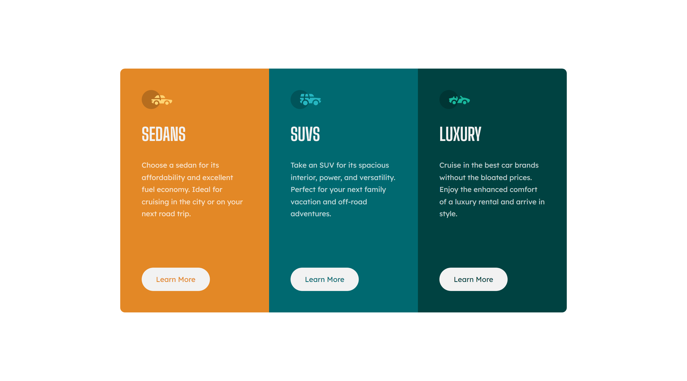

# Frontend Mentor - 3-column preview card component solution

This is a solution to the [3-column preview card component challenge on Frontend Mentor](https://www.frontendmentor.io/challenges/3column-preview-card-component-pH92eAR2-). Frontend Mentor challenges help you improve your coding skills by building realistic projects. 

## Table of contents

- [Overview](#overview)
  - [The challenge](#the-challenge)
  - [Screenshot](#screenshot)
  - [Links](#links)
- [My process](#my-process)
  - [Built with](#built-with)
  - [What I learned](#what-i-learned)
  - [Continued development](#continued-development)
  - [Useful resources](#useful-resources)
- [Author](#author)

## Overview

This is the second recommended project to start with as a beginner on Frontend Mentor, and is part of the Getting Started on Frontend Mentor (beginner) roadmap.

### The challenge

Users should be able to:

- View the optimal layout depending on their device's screen size
- See active states for interactive elements

### Screenshot

#### Desktop 

#### Mobile

### Links

- Solution URL: [Solution](https://www.frontendmentor.io/solutions/mobilefirst-design-using-css-grid-and-flexbox-Bqf2CMurlH)
- Live Site URL: [Live Site](https://frontendmentor-ilyesab.github.io/3-column-preview-card-component/)

## My process

### Built with

- Semantic HTML5 markup
- CSS custom properties
- Flexbox
- CSS Grid
- Mobile-first workflow

### What I learned

In this project CSS Grid seemed to be the right tool to use for the layout of the overall container.
to go from one column to three columns from mobile to desktop.

Grid also seemed like a great tool to layout the different elements on each of the columns creating the
appropriate spacing rather than using only margin. 

I also learned that using grids inside a parent grid keeps the elements aligned vertically when we go to the three columns layout on desktop.

### Continued development

I'd like to practice more the combination of CSS Flexbox and CSS Grid.

### Useful resources

- [Grid CheatSheet](https://grid.malven.co/) - A simple grid cheat sheet that helped remember the different CSS Grid properties.

## Author

- Frontend Mentor - [@ilyesab](https://www.frontendmentor.io/profile/ilyesab)
